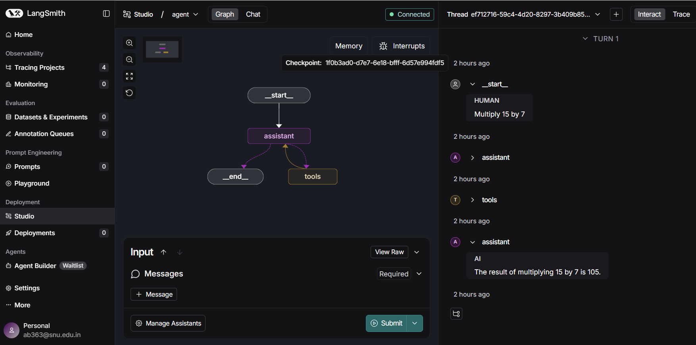
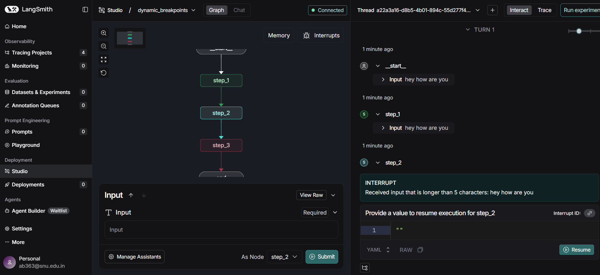
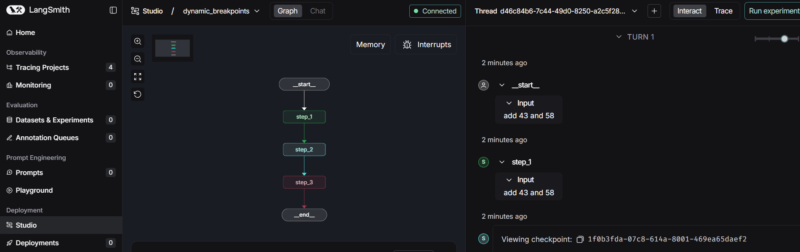

# AkshitBaliyan-langgraph-mat496

https://academy.langchain.com/courses/intro-to-langgraph

Roll No. : 2310110029 

## Module 1 

### Video 1 : 

**Learnings :** 

I learned  Lang Graph limitations as well as how it make it useful.                                                                                          
Then the difference between chain and agent architecture where chains follow fixed steps and agents can decide their own.
Then we see how LangGraph balances control and reliability, while also allowing persistence, streaming, and human involvement in workflows.

### Video 2 :

**Learnings :** 

In this part, I learned how to build a basic graph that makes a decision. The exercise involved using a simple dictionary input and a single condition to form a sentence.built the graph, visualized it to see the logic, and then tested it to make sure it worked as expected.

original file link : https://github.com/AkshitBaliyan/AkshitBaliyan-langgraph-mat496/blob/main/original/module-1/simple-graph.ipynb

**Tweaks I made:**

I expanded the graph from three to five nodes, each representing a different mood or outcome.
I updated the conditional edge logic so that after the first node, the graph randomly chooses one of four possible end nodes.
I adjusted the markdown and code to match the new structure, making sure the documentation and outputs reflect the five-node setup.

Modified work : https://github.com/AkshitBaliyan/AkshitBaliyan-langgraph-mat496/blob/main/Module1/simple-graph.ipynb

### Video 3 :

The graph that is done in Video 2, we did it same but on studio this time, 
but to do it on studio i have made changes in .py file also the same change done in video2.

### Video 4 :

In this I moved from simple graphs toChains by linking different components together. concept was to take a conversation history which is stored as a list of messages, create a custom tool, and then bind them with an LLM inside a graph.

original file link : https://github.com/AkshitBaliyan/AkshitBaliyan-langgraph-mat496/blob/main/original/module-1/chain.ipynb

Tweaking: Changes convo to How to play Uno and its related conversation. make my translational tool and replaced it in the code with the given one. also done tweaking in MessageState graph task, randomly ask about topic like contribution of Bhagat Singh for India.

Modified work : https://github.com/AkshitBaliyan/AkshitBaliyan-langgraph-mat496/blob/main/Module1/chain.ipynb

### Video 5 : 

In this video learned how to build a router that lets the LLM choose its own path. It can either use a specific tool if needed or just answer the question directly.
like it will give answer based on the condition met but if unrelated thing is asked then it will give answer according to it only.

original file link : https://github.com/AkshitBaliyan/AkshitBaliyan-langgraph-mat496/blob/main/original/module-1/router.ipynb

changes : made the division thing just like multiply func, it lets now to take two integer input and divide them to get answer. same thing is updated in router.py and checked on studio also and found out it give same result.
also checked on studio giving random question to know the diff result.

modified file link : https://github.com/AkshitBaliyan/AkshitBaliyan-langgraph-mat496/blob/main/Module1/router.ipynb

 

### Video 6 : 

Make a agent with diff tools that can soolve many maths problem. We used React Architecture which used loop until the answer is found, they used a tool then forward it to another tool as per the req basically using multiple tools until answer is found.

original link: https://github.com/AkshitBaliyan/AkshitBaliyan-langgraph-mat496/blob/main/original/module-1/agent.ipynb

tweaking : add more function/tools for solving maths problem. changed input make them complex and test with all diff tools whether they are working or not.

modified link : https://github.com/AkshitBaliyan/AkshitBaliyan-langgraph-mat496/blob/main/Module1/agent.ipynb

### Video 7 :

**Learnings :** 
Learnt how agent keep track of memory using threads nd results is obtained. 

original link : https://github.com/AkshitBaliyan/AkshitBaliyan-langgraph-mat496/blob/main/original/module-1/agent-memory.ipynb

**tweaking:** 
added some tools first, then performa a operation using one of the tool and then again perform a operation on that result to check memory is being kept by agent or not.

modified link : https://github.com/AkshitBaliyan/AkshitBaliyan-langgraph-mat496/blob/main/Module1/agent-memory.ipynb

## Module 2 

### Video 1 :

Learnt about the structure of the graph its schema. In this structure we defin the types and allowed values. but we found that in case of typedict and dataclass it is not strictly followed andd we can assign a invalid value also . to prevet this we noticed and learnt about the pydantic which prevents from happening this and throw error if no values is found.

Original file link : https://github.com/AkshitBaliyan/AkshitBaliyan-langgraph-mat496/blob/main/original/module-2/state-schema.ipynb

Tweaking : 
Change the entrire code from 2 node split strucure to 5 node split strucure with equal chances , previousely it was based on the mood but i modified it one the basis of sports i plays.

Modified file Link : https://github.com/AkshitBaliyan/AkshitBaliyan-langgraph-mat496/blob/main/Module2/state-schema.ipynb

### Vidoe 2 :

learned that state reducers control how data updates when multiple nodes change the same variable. 
default wise if we see , updates just overwrite values, and its causes conflicts in parallel runs. Reducers fix this by merging updates safely by appending, custom merging or handling nulls.
also discovered how message IDs let you rewrite or remove specific messages, even changing who sent them.

Original link : https://github.com/AkshitBaliyan/AkshitBaliyan-langgraph-mat496/blob/main/original/module-2/state-reducers.ipynb

Tweaking : 
I expanded the graph to 7 nodes , tested custom reducers, switched keys and tweaked messages to see how reducerss keep everything consistent.

Modifies work linkk : https://github.com/AkshitBaliyan/AkshitBaliyan-langgraph-mat496/blob/main/Module2/state-reducers.ipynb

### Vidoe 3 :

Got to know about the private states and how it works . It allow diff nodes to share info without affecting the input or final output.can be used when we dont want to show steps and just the final output.
also explor custom Input/Output schemas, custom I/O schemas let you filter or control what is visible and whats internal.

Original link : https://github.com/AkshitBaliyan/AkshitBaliyan-langgraph-mat496/blob/main/original/module-2/multiple-schemas.ipynb

Tweaking : 
made my own graph with a bit longer chain, added few more private states to check outputs stay hidden or not. Then work with input and output schemas to see what changes. 
Also put some extra intermediate nodes in between and changed how data handled in the return part

Modifies link : https://github.com/AkshitBaliyan/AkshitBaliyan-langgraph-mat496/blob/main/Module2/multiple-schemas.ipynb

### Vidoe 4 :

Learnt about message reducers, filters and trimmers, basically how they control how much of the chat history goes to the model every turn. Also saw that keeping the same message channel helps reshape the convo thread without breaking the LangGraph.

We started with reducers again, then added filtering, where only the last message is sent but whole convo still shown in output. Then trimming, where we can send just part of previous messages to give some context.

Original link : https://github.com/AkshitBaliyan/AkshitBaliyan-langgraph-mat496/blob/main/original/module-2/trim-filter-messages.ipynb

Tweaking : 
Made my own convo.  Watched how the model takes in different amounts of messages and how that changes its replies. Also tried partial trimming to see how input gets shorter. 
in last i have also added screnshots and links for the reference .

Modifies link :https://github.com/AkshitBaliyan/AkshitBaliyan-langgraph-mat496/blob/main/Module2/trim-filter-messages.ipynb

### Vidoe 5 :

Learnt how to generate summary of the messages and how bot stores past chats and can summarise them also.lean how can we give memory to bot using memorysaver and thread id.

Original link : https://github.com/AkshitBaliyan/AkshitBaliyan-langgraph-mat496/blob/main/original/module-2/chatbot-summarization.ipynb

Tweaking : 
Made my own convo. Change name to Akshit from Lance, change the ocnvo from football sport to cricket sport and also asked about the player virat kohli in htat and then summarise it and check the result for the same in Langgraph site under traces.

Modifies link : https://github.com/AkshitBaliyan/AkshitBaliyan-langgraph-mat496/blob/main/Module2/chatbot-summarization.ipynb

### Vidoe 6 :

using LangGraph and a sqlite checkpointer, i Learn how to build a chatbot with summarization and external memory. and also how chatbot stored conversation in a local database allowing recovery even after restarts.

Original link : https://github.com/AkshitBaliyan/AkshitBaliyan-langgraph-mat496/blob/main/original/module-2/chatbot-external-memory.ipynb

Tweaking : 
Used LangGraph studio to visualise and run the workflow. change name to Akshit replacing Lance everywhere, updated my own convo and ask diff things based on my own convo. 

Modifies link : https://github.com/AkshitBaliyan/AkshitBaliyan-langgraph-mat496/blob/main/Module2/chatbot-external-memory.ipynb

## Module 3

### Video 1 :

learn about the human in loop interaction. then saw how sync and async streaming works.
get to know how to stream chat model tokens live.

Original link : https://github.com/AkshitBaliyan/AkshitBaliyan-langgraph-mat496/blob/main/original/module-3/streaming-interruption.ipynb

Tweaking : 
Used LangGraph studio to see graph . change name to Akshit replacing Lance everywhere, topic change to IPL related to a cricket team. and alll streaming examples updated with the new conversation topics

Modifies link : https://github.com/AkshitBaliyan/AkshitBaliyan-langgraph-mat496/blob/main/Module3/streaming-interruption.ipynb

### Video 2 :

learnt about hoe breakpoints work. helps us how to add some user input in middle of the execution of tasks.

Original link : https://github.com/AkshitBaliyan/AkshitBaliyan-langgraph-mat496/blob/main/original/module-3/breakpoints.ipynb

Tweaking : 
Used LangGraph studio to see change . change name to Akshit replacing Lance everywhere, change multiplying values, alter addition func values,  added more tools, gave more breakpoint options. observed change in studio also

Modifies link : https://github.com/AkshitBaliyan/AkshitBaliyan-langgraph-mat496/blob/main/Module3/breakpoints.ipynb

### Video 3 :

get to know how to Edit state with  human feedback when it is being executed. during execution the user is aked to edit the feedback that they want to change and then the changed is reflected automatically in the code.

Original link : https://github.com/AkshitBaliyan/AkshitBaliyan-langgraph-mat496/blob/main/original/module-3/edit-state-human-feedback.ipynb

Tweaking : 
added subtract function to tools list
changed name to "Akshit" in all conversation examples
updated multiplication values (15×7, 8×12)
and also added variety with addition example (25+35)

Modifies link : https://github.com/AkshitBaliyan/AkshitBaliyan-langgraph-mat496/blob/main/Module3/edit-state-human-feedback.ipynb

### Video 4 :

in this section a dynamic breakpoint was made, and how it affects the flow was observed.
also learnt how to update graph state after interruption and also checked the result on studio

Original link : https://github.com/AkshitBaliyan/AkshitBaliyan-langgraph-mat496/blob/main/original/module-3/dynamic_breakpoints.ipynb

Tweaking : 
asked hey how are you instead of hello world. and hi to hey making sure in case 1it still greater than 5 char length and less than 5 character in case 2.

Modifies link : https://github.com/AkshitBaliyan/AkshitBaliyan-langgraph-mat496/blob/main/Module3/dynamic_breakpoints.ipynb

### Video 5 :

learnt about forking and replaying in a graph. check the result and observe the same on studio as well.

Original link : https://github.com/AkshitBaliyan/AkshitBaliyan-langgraph-mat496/blob/main/original/module-3/time-travel.ipynb

Tweaking : 
modify with my name, asked to multiply 15 with 7 , also changed addition values, add a subtract operator also in both time-travel as well as in agent.py

Modifies link : https://github.com/AkshitBaliyan/AkshitBaliyan-langgraph-mat496/blob/main/Module3/time-travel.ipynb

## Module 4

### Video 1 :

learnt about the parallel nodes working and it execution, how fan in and fan out works , also how web search agent goes through web and wikipedia. also when nodes run in parallel how langgrapgh sets them in format.

Original link : https://github.com/AkshitBaliyan/AkshitBaliyan-langgraph-mat496/blob/main/original/module-4/parallelization.ipynb

Tweaking : 
change queries to Summarize Royal Challengers Bangalore’s IPL 2024 season in 2 sentences. 
API streaming: Summarize RCB’s IPL 2024 season in one sentence
also saw the changes and update in studio as well

Modifies link : https://github.com/AkshitBaliyan/AkshitBaliyan-langgraph-mat496/blob/main/Module4/parallelization.ipynb

